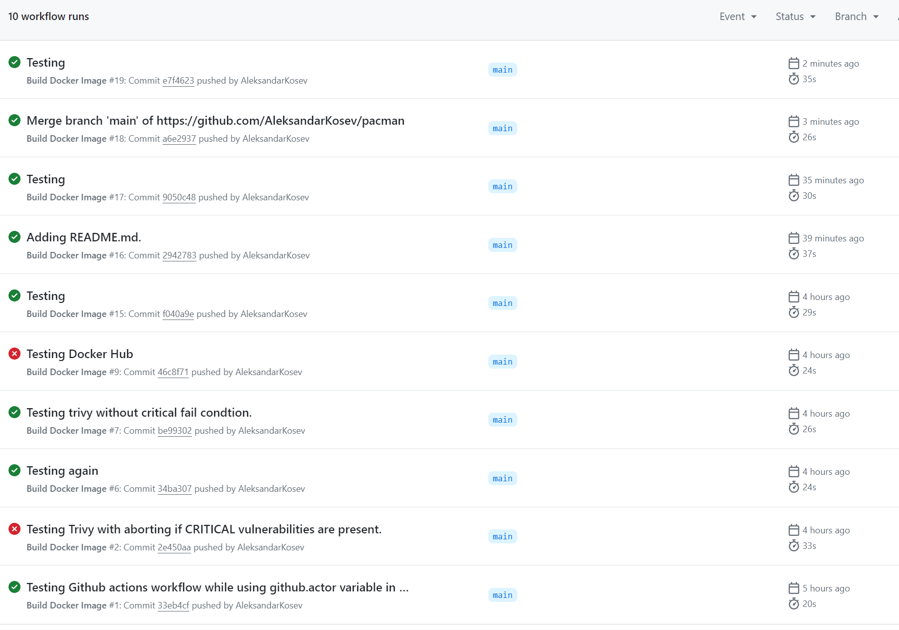
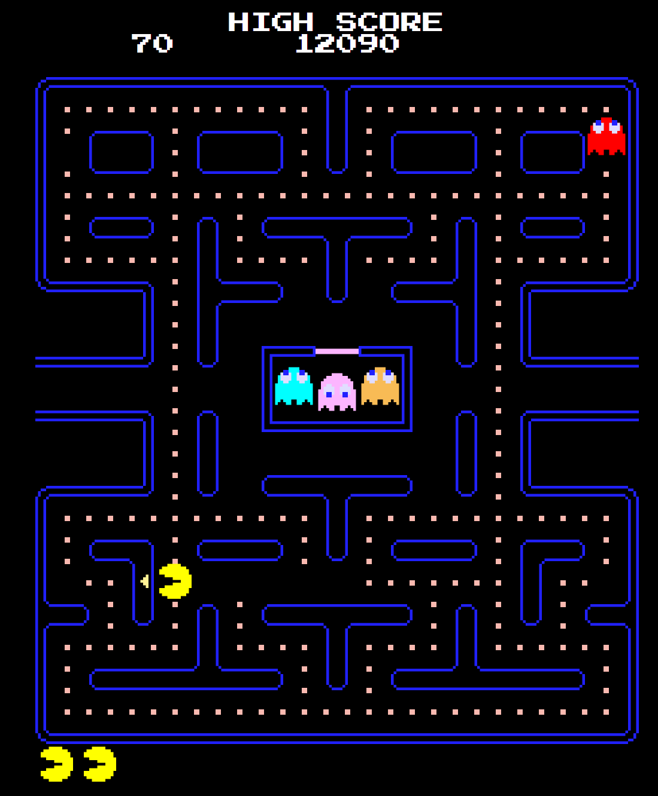

# Pacman


[](LICENSE)
[](https://github.com/AleksandarKosev/pacman/actions)
[](https://hub.docker.com/repository/docker/aleksandarkosev/pacman)
[](https://github.com/AleksandarKosev/pacman/graphs/contributors)

> **Description**: This repository contains the pacman game along with a python script that hosts the game locally. Further more it contains a DockerFile which builds it into a container. Github Actions Workflow was also added which upon pushing to main it builds, scans any vulnerabilities with <a href="https://github.com/aquasecurity/trivy">Trivy</a>, fails if there are CRITICAL vulnerabilities or merges with main if there are none. In the end it also pushs the image to Docker Hub. When a pull request is made, it builds and tests the image before merging happens. 

## 🚀 Features

- ✨ **Feature 1**: Pacman in JavaScript.
- ⚡ **Feature 2**: Python script which hosts the game locally.
- 💎 **Feature 3**: Dockerfile which builds the project into an image. 
- 🔥 **Feature 4**: Using <a href="https://docs.github.com/en/actions/writing-workflows">Github Actions Workflow</a> to build the project, scan it with Trivy and push both to master and docker hub if no CRITICAL vulnerabilities are found.
- 🔒 **Security**: Good pratices for optimizing and securing the container and workflow. 
- 🛠️ **Customization**: Level Up can be done on this repository by switching to Flash or Django for hosting for multiplayer, also maybe adding more games in the future. 

## 🛠️ Installation

### Prerequisites

- [Docker](https://docs.docker.com/engine/install/)
- [GitHub Account](https://github.com/)
- [Docker Hub Account](https://hub.docker.com/)

### Setup

```bash
# Clone and Navigate to the repository
git clone https://github.com/AleksandarKosev/pacman
cd pacman

# You can even play it eve now by just running this(assuming you have python installed)
python main.py
# To access the game, open the browser and go to "localhost:8080"

# This builds the project.
docker build -f Dockerfile -t aleksandarkosev/pacman:latest . --build-arg VERSION=1

# This runs the container
docker run -d -p 8080:8080 aleksandarkosev/pacman:latest

# We get the same effect as running the python script, but with more perks.
```

## Detailed Explanation
This repositry has four importand parts that needs pointing out.
<ul>
<li><a href="#python">Python script "main.py": for hosting the game</a></li>
<li><a href ="#dockerfile">Dockerfile: For Building the project</a></li>
<li><a href="#yml">docker-build.yml: Responsible for Github Actions Workflow</a></li>
</ul>

### main.py
<p id="python"> </p>
The python script is pretty much straightforward, it can be diveded into two parts. One part as preparation and the other part that hosts the game.

```python
def shutdown_server(signum, frame):
    httpd.shutdown()
    print("Server shutting down...")

# We can choose any port.
PORT = 8080

#Logging activity
logging.basicConfig(level=logging.INFO)
logger = logging.getLogger(__name__)

#Check if folder exists actually
WEB_DIR = os.path.abspath("pacman")
if not os.path.exists(WEB_DIR):
    raise FileNotFoundError(f"Directory {WEB_DIR} does not exist")
os.chdir(WEB_DIR)
```

```python
#Hosting the game on the most simplest way, logging the activity and gracefully catching if something goes wrong.
Handler = http.server.SimpleHTTPRequestHandler
try:
    with socketserver.TCPServer(("", PORT), Handler) as httpd:
        print(f"Serving website on http://localhost:{PORT}")
        logger.info(f"Serving website on http://localhost:{PORT}")
        httpd.serve_forever()
except Exception as e:
    print(f"Server failed to start: {e}")
    logger.info(f"Server failed to start: {e}")

#Cleaning up.
signal.signal(signal.SIGINT, shutdown_server)
signal.signal(signal.SIGTERM, shutdown_server)
```
### Dockerfile
<p id="dockerfile"> </p>

The dockerfile consists of basic set of instructions for building the project into an image.
```bash
# Use an official Python runtime as the base image
FROM python:3.12.4-alpine

# Set the working directory in the container
WORKDIR /app

# We create a user instead of using a root user for the container. We do this to increase protection.
RUN addgroup -S appgroup && adduser -S appuser -G appgroup

# Copy the website files into the container using above created user.
COPY --chown=appuser:appgroup ./ ./pacman

# Copy the Python script into the container using above created user.
COPY --chown=appuser:appgroup main.py .

# Switch to the non-root user
USER appuser

# We enable the healthcheck feature of docker, to monitor the container.
HEALTHCHECK --interval=30s --timeout=10s --start-period=5s --retries=3 \
CMD curl --fail http://localhost:8080/health || exit 1

# Expose the port the server will run on
EXPOSE 8080

# Run the Python script when the container starts
CMD ["python", "main.py"]
```
### docker-build.yml
<p id="yml"> </p>

```yml
# Naming the Image
name: Build Docker Image

# We specify which branch the Github action workflow will work on.
on:
  push:
    branches:
      - main
      - develop
  pull_request:
    branches:
      - main

# We specify the OS
jobs:
  build:
    runs-on: ubuntu-latest

    steps:
    # Check out the repository to the runner
    - name: Check out the repository
      uses: actions/checkout@v3

    # Set up Docker Buildx (optional, but useful for multi-platform builds)
    - name: Set up Docker Buildx
      uses: docker/setup-buildx-action@v2

    # Log in to Docker Hub (optional, if you want to push the image)
    - name: Log in to Docker Hub
      uses: docker/login-action@v2
      with:
        #Curentlly this secrets are at( https://github.com/AleksandarKosev/pacman/settings/secrets/actions )
        username: ${{ secrets.DOCKER_USERNAME }}
        password: ${{ secrets.DOCKER_PASSWORD }}

    # Build the Docker image, using current authenticated github user.
    - name: Build the Docker image
      run: |
        docker build -f Dockerfile -t aleksandarkosev/pacman:latest . --build-arg VERSION=1

    # Download Trivy, used for finding and reporting vulnerabilities.
    - name: Install Trivy
      run: |
        wget https://github.com/aquasecurity/trivy/releases/download/v0.36.0/trivy_0.36.0_Linux-64bit.deb
        sudo dpkg -i trivy_0.36.0_Linux-64bit.deb
      
    #This part of the action is ran when pushing code.
    #The condition is, if Trivy detects CRITICAL vulnerabilities, it would abort the workflow.
    - name: Run Trivy Scan(Pushing Changes to repo.)
      if: github.event_name == 'push'
      run: |
        trivy image --severity CRITICAL --exit-code 1 --no-progress aleksandarkosev/pacman:latest
    
    - name: Run Trivy Scan(Pull Request)
      if: github.event_name == 'pull'
      run: |
        trivy image aleksandarkosev/pacman:latest
        docker build -t aleksandarkosev/pacman:latest .
        docker run -d -p 8080:8080 aleksandarkosev/pacman:latest
    
    # Push the Docker image to Docker Hub found here( https://hub.docker.com/repository/docker/aleksandarkosev/pacman/general )
    - name: Push the Docker image
      if: github.event_name == 'push'
      run: |
        docker push aleksandarkosev/pacman:latest
```
### The actions workflow should look like this after a few runs. 
<br>



## Testing the image
We can test the image by doing the following(assuming you have docker hub installed):
```bash
docker pull aleksandarkosev/pacman:latest

#double check if the image is downloaded
docker images

#Run the container on port 8080 and play the game :D 
docker run -d -p 8080:8080 aleksandarkosev/pacman:latest
```


